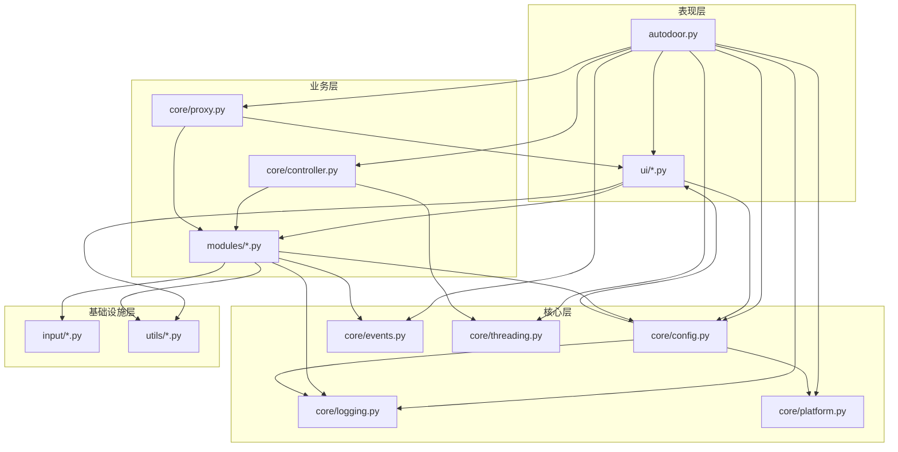

# AutoDoor 项目架构文档

## 版本信息

| 项目 | 内容 |
|------|------|
| 文档版本 | v2.0 |
| 项目版本 | v2.0.4 |
| 适用范围 | AutoDoor OCR 识别系统 |

---

## 1. 系统概述

### 1.1 项目简介

AutoDoor 是一个基于 OCR 的自动识别和操作系统，主要功能包括：

1. **文字识别**：监控指定屏幕区域，识别关键词并触发相应动作
2. **定时功能**：按照设定的时间间隔执行按键操作
3. **数字识别**：监控指定区域的数字变化并触发动作
4. **脚本执行**：支持录制和执行自动化脚本
5. **颜色识别**：识别屏幕颜色变化并触发动作
6. **报警功能**：在触发动作时播放报警声音

### 1.2 技术栈

| 技术 | 用途 |
|------|------|
| Python 3.12 | 主要开发语言 |
| Tkinter | GUI 框架 |
| Tesseract OCR | 文字识别引擎 |
| PyAutoGUI | 鼠标键盘自动化 |
| Pygame | 音频播放 |
| PIL/Pillow | 图像处理 |
| pynput | 全局键盘监听 |

---

## 2. 系统架构

### 2.1 整体架构图

```
┌────────────────────────────────────────────────────────────────────────────┐
│                              AutoDoor OCR 系统                             │
├────────────────────────────────────────────────────────────────────────────┤
│                                                                            │
│  ┌─────────────────────────────────────────────────────────────────────┐   │
│  │                        表现层 (Presentation Layer)                   │   │
│  │  ┌─────────────────────────────────────────────────────────────┐    │   │
│  │  │  autodoor.py - 应用入口、主窗口、生命周期管理                  │    │   │
│  │  │  ui/*.py - 各标签页、UI组件、样式、验证器                      │    │   │
│  │  └─────────────────────────────────────────────────────────────┘    │   │
│  └─────────────────────────────────────────────────────────────────────┘   │
│                                    │                                       │
│                                    ▼                                       │
│  ┌─────────────────────────────────────────────────────────────────────┐   │
│  │                        业务层 (Business Layer)                       │   │
│  │  ┌─────────────────────────────────────────────────────────────┐    │   │
│  │  │  modules/*.py - OCR、定时、数字识别、脚本、颜色识别模块         │    │   │
│  │  │  core/controller.py - 模块控制器                             │    │   │
│  │  │  core/proxy.py - 功能代理类                                  │    │   │
│  │  └─────────────────────────────────────────────────────────────┘    │   │
│  └─────────────────────────────────────────────────────────────────────┘   │
│                                    │                                       │
│                                    ▼                                       │
│  ┌─────────────────────────────────────────────────────────────────────┐   │
│  │                        核心层 (Core Layer)                           │   │
│  │  ┌─────────────────────────────────────────────────────────────┐    │   │
│  │  │  core/config.py - 配置管理                                   │    │   │
│  │  │  core/events.py - 事件管理                                   │    │   │
│  │  │  core/logging.py - 日志管理                                  │    │   │
│  │  │  core/threading.py - 线程管理                                │    │   │
│  │  │  core/platform.py - 平台适配                                 │    │   │
│  │  │  core/utils.py - 通用工具                                    │    │   │
│  │  └─────────────────────────────────────────────────────────────┘    │   │
│  └─────────────────────────────────────────────────────────────────────┘   │
│                                    │                                       │
│                                    ▼                                       │
│  ┌─────────────────────────────────────────────────────────────────────┐   │
│  │                    基础设施层 (Infrastructure Layer)                 │   │
│  │  ┌─────────────────────────────────────────────────────────────┐    │   │
│  │  │  input/*.py - 输入控制、权限管理                              │    │   │
│  │  │  utils/*.py - 图像处理、键盘操作、区域选择、OCR管理             │    │   │
│  │  └─────────────────────────────────────────────────────────────┘    │   │
│  └─────────────────────────────────────────────────────────────────────┘   │
│                                                                            │
└────────────────────────────────────────────────────────────────────────────┘
```

### 2.2 目录结构

```
autodoor/
├── autodoor.py              # 主应用入口文件
│
├── ui/                      # 用户界面层
│   ├── basic_tab.py         # 基本设置标签页
│   ├── builder.py           # UI 构建器
│   ├── home.py              # 首页标签页
│   ├── number_tab.py        # 数字识别标签页
│   ├── ocr_tab.py           # 文字识别标签页
│   ├── script_tab.py        # 脚本运行标签页
│   ├── timed_tab.py         # 定时功能标签页
│   ├── styles.py            # UI 样式配置
│   ├── utils.py             # UI 通用工具函数
│   └── validators.py        # 输入验证器
│
├── core/                    # 核心功能层
│   ├── config.py            # 配置管理器
│   ├── controller.py        # 模块控制器
│   ├── events.py            # 事件管理器
│   ├── logging.py           # 日志管理器
│   ├── platform.py          # 平台适配器
│   ├── proxy.py             # 功能代理类
│   ├── threading.py         # 线程管理器
│   └── utils.py             # 核心工具函数
│
├── modules/                 # 业务功能模块
│   ├── alarm.py             # 报警模块
│   ├── color.py             # 颜色识别模块
│   ├── input.py             # 键盘事件执行器
│   ├── number.py            # 数字识别模块
│   ├── ocr.py               # OCR 识别模块
│   ├── recorder.py          # 录制模块
│   ├── script.py            # 脚本执行器
│   └── timed.py             # 定时功能模块
│
├── input/                   # 输入控制层
│   ├── controller.py        # 输入控制器
│   ├── keyboard.py          # 键盘操作与快捷键
│   └── permissions.py       # 权限管理
│
├── utils/                   # 工具函数层
│   ├── image.py             # 图像处理工具
│   ├── keyboard.py          # 键盘操作工具
│   ├── region.py            # 区域选择工具
│   ├── tesseract.py         # Tesseract OCR 管理
│   └── version.py           # 版本检查工具
│
├── tesseract/               # Tesseract OCR 引擎
│   ├── tessdata/            # 语言数据
│   └── *.dll                # 依赖库
│
└── voice/                   # 音频资源
    ├── alarm.mp3            # 报警音效
    └── temp_reversed.mp3    # 停止音效
```

---

## 3. 模块划分与职责

### 3.1 表现层模块

| 模块 | 文件 | 职责 | 主要接口 |
|------|------|------|----------|
| 主应用 | `autodoor.py` | 应用入口、生命周期管理、模块协调 | `AutoDoorOCR` 类 |
| 首页 | `ui/home.py` | 首页标签页创建、状态显示 | `create_home_tab()` |
| OCR标签页 | `ui/ocr_tab.py` | OCR标签页创建、组管理 | `create_ocr_tab()`, `create_ocr_group()` |
| 定时标签页 | `ui/timed_tab.py` | 定时功能标签页创建 | `create_timed_tab()`, `create_timed_group()` |
| 数字标签页 | `ui/number_tab.py` | 数字识别标签页创建 | `create_number_tab()`, `create_number_region()` |
| 脚本标签页 | `ui/script_tab.py` | 脚本运行标签页创建 | `create_script_tab()` |
| 基本设置 | `ui/basic_tab.py` | 基本设置标签页创建 | `create_basic_tab()` |
| UI工具 | `ui/utils.py` | UI通用工具函数 | `show_message()`, `toggle_ui_state()` |
| 样式配置 | `ui/styles.py` | 全局UI样式配置 | `configure_styles()` |
| 验证器 | `ui/validators.py` | 输入验证逻辑 | `validate_numeric_input()` |

### 3.2 业务层模块

| 模块 | 文件 | 职责 | 主要接口 |
|------|------|------|----------|
| OCR模块 | `modules/ocr.py` | OCR识别核心逻辑 | `start_monitoring()`, `stop_monitoring()` |
| 定时模块 | `modules/timed.py` | 定时任务执行 | `start_timed_tasks()`, `stop_timed_tasks()` |
| 数字识别模块 | `modules/number.py` | 数字识别逻辑 | `start_number_recognition()`, `stop_number_recognition()` |
| 脚本模块 | `modules/script.py` | 脚本录制与执行 | `start_script()`, `stop_script()`, `start_recording()` |
| 颜色识别模块 | `modules/color.py` | 颜色识别逻辑 | `start_color_recognition()`, `stop_color_recognition()` |
| 报警模块 | `modules/alarm.py` | 报警音效播放 | `play_alarm()`, `play_start_sound()`, `play_stop_sound()` |
| 输入执行器 | `modules/input.py` | 键盘事件执行 | `execute_key_press()` |
| 录制模块 | `modules/recorder.py` | 操作录制逻辑 | `start_recording()`, `stop_recording()` |

### 3.3 核心层模块

| 模块 | 文件 | 职责 | 主要接口 |
|------|------|------|----------|
| 配置管理器 | `core/config.py` | 配置读写、版本迁移 | `load_config()`, `save_config()`, `setup_config_listeners()` |
| 事件管理器 | `core/events.py` | 事件队列管理 | `add_event()`, `process_events()`, `clear_events()` |
| 日志管理器 | `core/logging.py` | 日志记录与显示 | `log_message()`, `clear_log()` |
| 线程管理器 | `core/threading.py` | 线程生命周期管理 | `start()`, `stop()`, `add_thread()` |
| 平台适配器 | `core/platform.py` | 跨平台兼容性处理 | `get_config_dir()`, `get_log_file_path()` |
| 模块控制器 | `core/controller.py` | 模块启停统一控制 | `start_all()`, `stop_all()`, `start_module()` |
| 代理类 | `core/proxy.py` | 功能模块代理封装 | `OCRProxy`, `TimedProxy`, `NumberProxy`, `ScriptProxy`, `ColorProxy`, `UIProxy` |
| 核心工具 | `core/utils.py` | 通用工具函数 | `exit_program()`, `add_group()`, `delete_group()` |

### 3.4 基础设施层模块

| 模块 | 文件 | 职责 | 主要接口 |
|------|------|------|----------|
| 输入控制器 | `input/controller.py` | 输入操作封装 | `InputController` 类 |
| 键盘操作 | `input/keyboard.py` | 快捷键绑定、按键列表 | `setup_shortcuts()`, `get_available_keys()` |
| 权限管理 | `input/permissions.py` | 系统权限检查 | `check_macos_permissions()` |
| 图像处理 | `utils/image.py` | 图像预处理 | `preprocess_image()`, `capture_screen()` |
| 区域选择 | `utils/region.py` | 屏幕区域选择 | `select_region()`, `cancel_selection()` |
| Tesseract管理 | `utils/tesseract.py` | OCR引擎管理 | `check_tesseract_availability()`, `set_tesseract_path()` |
| 版本检查 | `utils/version.py` | 版本更新检查 | `check_for_updates()`, `open_bilibili()` |

---

## 4. 模块间接口定义

### 4.1 核心接口规范

#### 4.1.1 配置管理器接口

```python
class ConfigManager:
    """配置管理器接口"""
    
    def read_config(self) -> dict | None:
        """读取配置文件"""
        pass
    
    def save_config(self, config: dict) -> bool:
        """保存配置文件"""
        pass
    
    def load_config(self) -> None:
        """加载并应用配置"""
        pass
    
    def get_full_config(self) -> dict:
        """获取完整配置数据"""
        pass
    
    def defer_save_config(self) -> None:
        """延迟保存配置（防抖）"""
        pass
    
    def setup_config_listeners(self) -> None:
        """设置配置变更监听器"""
        pass
```

#### 4.1.2 事件管理器接口

```python
class EventManager:
    """事件管理器接口"""
    
    def start_event_thread(self) -> None:
        """启动事件处理线程"""
        pass
    
    def add_event(self, event: tuple, module_info: tuple = None, priority: int = None) -> None:
        """添加事件到队列"""
        pass
    
    def clear_events(self) -> None:
        """清空事件队列"""
        pass
    
    def execute_event(self, event_data: tuple) -> None:
        """执行单个事件"""
        pass
```

#### 4.1.3 线程管理器接口

```python
class ThreadManager:
    """线程管理器接口"""
    
    def start(self, module: str, start_func: callable, stop_func: callable, log_prefix: str) -> int:
        """启动模块线程"""
        pass
    
    def stop(self, module: str, stop_func: callable, log_prefix: str) -> None:
        """停止模块线程"""
        pass
    
    def add_thread(self, module: str, thread: threading.Thread) -> None:
        """添加线程到管理器"""
        pass
    
    def get_threads(self, module: str) -> list:
        """获取模块的所有线程"""
        pass
```

#### 4.1.4 模块控制器接口

```python
class ModuleController:
    """模块控制器接口"""
    
    def start_module(self, module_name: str, start_func: callable) -> None:
        """统一启动模块"""
        pass
    
    def start_all(self) -> None:
        """启动所有已启用的模块"""
        pass
    
    def stop_all(self) -> None:
        """停止所有模块"""
        pass
```

### 4.2 代理类接口

#### 4.2.1 OCR代理接口

```python
class OCRProxy:
    """OCR功能代理"""
    
    def create_tab(self, parent: tk.Widget) -> None:
        """创建OCR标签页"""
        pass
    
    def create_group(self, index: int) -> None:
        """创建OCR组"""
        pass
    
    def add_group(self) -> None:
        """新增OCR组"""
        pass
    
    def delete_group(self, index: int, confirm: bool = True) -> None:
        """删除OCR组"""
        pass
    
    def start_monitoring(self) -> None:
        """开始监控"""
        pass
    
    def stop_monitoring(self) -> None:
        """停止监控"""
        pass
```

#### 4.2.2 脚本代理接口

```python
class ScriptProxy:
    """脚本功能代理"""
    
    def create_tab(self, parent: tk.Widget) -> None:
        """创建脚本标签页"""
        pass
    
    def start(self, start_color_recognition: bool = True) -> None:
        """启动脚本"""
        pass
    
    def stop(self, stop_color_recognition: bool = True) -> None:
        """停止脚本"""
        pass
    
    def start_recording(self) -> None:
        """开始录制"""
        pass
    
    def stop_recording(self) -> None:
        """停止录制"""
        pass
```

---

## 5. 数据流转流程

### 5.1 应用启动流程

```
┌─────────────────────────────────────────────────────────────────────────────┐
│                            应用启动流程                                      │
├─────────────────────────────────────────────────────────────────────────────┤
│                                                                             │
│  1. main()                                                                  │
│     │                                                                       │
│     ▼                                                                       │
│  2. AutoDoorOCR.__init__()                                                  │
│     │                                                                       │
│     ├──► _init_basic_settings()     # 初始化基础变量                         │
│     │                                                                       │
│     ├──► _init_platform()           # 初始化平台适配器                       │
│     │                                                                       │
│     ├──► _init_managers()           # 初始化管理器                           │
│     │    ├── LoggingManager                                                 │
│     │    ├── VersionChecker                                                 │
│     │    ├── ThreadManager                                                  │
│     │    ├── EventManager                                                   │
│     │    ├── ConfigManager                                                  │
│     │    └── PermissionManager                                              │
│     │                                                                       │
│     ├──► _init_proxy_classes()      # 初始化代理类                           │
│     │    ├── OCRProxy                                                       │
│     │    ├── TimedProxy                                                     │
│     │    ├── NumberProxy                                                    │
│     │    ├── ScriptProxy                                                    │
│     │    ├── ColorProxy                                                     │
│     │    └── UIProxy                                                        │
│     │                                                                       │
│     ├──► _init_ui()                 # 初始化用户界面                         │
│     │    ├── 创建主窗口                                                     │
│     │    ├── 初始化Tkinter变量                                              │
│     │    └── create_widgets()                                               │
│     │                                                                       │
│     ├──► _init_modules()            # 初始化功能模块                         │
│     │    ├── OCRModule                                                      │
│     │    ├── TimedModule                                                    │
│     │    ├── NumberModule                                                   │
│     │    ├── AlarmModule                                                    │
│     │    ├── ScriptModule                                                   │
│     │    ├── TesseractManager                                               │
│     │    └── ColorRecognitionManager                                        │
│     │                                                                       │
│     ├──► _load_config()             # 加载配置                               │
│     │                                                                       │
│     └──► _start_services()          # 启动服务                               │
│          ├── 权限检查 (macOS)                                               │
│          ├── 配置监听器                                                     │
│          ├── Tesseract检测                                                  │
│          ├── 快捷键绑定                                                     │
│          └── 事件处理线程                                                   │
│                                                                             │
│  3. run()                           # 进入主循环                             │
│                                                                             │
└─────────────────────────────────────────────────────────────────────────────┘
```

### 5.2 OCR识别流程

```
┌─────────────────────────────────────────────────────────────────────────────┐
│                            OCR识别流程                                       │
├─────────────────────────────────────────────────────────────────────────────┤
│                                                                             │
│  用户操作                                                                    │
│     │                                                                       │
│     ▼                                                                       │
│  ┌─────────────────┐                                                        │
│  │ 点击"开始监控"   │                                                        │
│  └────────┬────────┘                                                        │
│           │                                                                 │
│           ▼                                                                 │
│  ┌─────────────────────────────────────────────────────────────┐            │
│  │ OCRModule.start_monitoring()                                │            │
│  │  ├── 检查Tesseract可用性                                     │            │
│  │  ├── 检查是否有启用的识别组                                   │            │
│  │  ├── 设置运行状态                                            │            │
│  │  └── 启动OCR线程                                             │            │
│  └──────────────────────────┬──────────────────────────────────┘            │
│                             │                                               │
│                             ▼                                               │
│  ┌─────────────────────────────────────────────────────────────┐            │
│  │ OCRModule.ocr_loop() [后台线程]                              │            │
│  │  │                                                          │            │
│  │  ├──► 循环处理每个OCR组                                      │            │
│  │  │    ├── 检查识别间隔                                       │            │
│  │  │    ├── 截取屏幕区域                                       │            │
│  │  │    ├── 图像预处理                                         │            │
│  │  │    ├── OCR识别                                           │            │
│  │  │    ├── 关键词匹配                                         │            │
│  │  │    └── 触发动作                                           │            │
│  │  │                                                          │            │
│  │  └──► 检测停止信号，退出循环                                  │            │
│  └─────────────────────────────────────────────────────────────┘            │
│                                                                             │
└─────────────────────────────────────────────────────────────────────────────┘
```

### 5.3 事件处理流程

```
┌─────────────────────────────────────────────────────────────────────────────┐
│                            事件处理流程                                      │
├─────────────────────────────────────────────────────────────────────────────┤
│                                                                             │
│  事件源                                                                      │
│  (OCR识别/定时任务/数字识别/脚本)                                             │
│     │                                                                       │
│     ▼                                                                       │
│  ┌─────────────────────────────────────────────────────────────┐            │
│  │ EventManager.add_event(event, module_info, priority)        │            │
│  │  ├── 确定优先级                                              │            │
│  │  └── 添加到优先级队列                                         │            │
│  └──────────────────────────┬──────────────────────────────────┘            │
│                             │                                               │
│                             ▼                                               │
│  ┌─────────────────────────────────────────────────────────────┐            │
│  │ PriorityQueue [(priority, event, module_info), ...]         │            │
│  └──────────────────────────┬──────────────────────────────────┘            │
│                             │                                               │
│                             ▼                                               │
│  ┌─────────────────────────────────────────────────────────────┐            │
│  │ EventManager.process_events() [后台线程]                     │            │
│  │  │                                                          │            │
│  │  ├──► 循环取出事件                                           │            │
│  │  │    ├── execute_event(event_data)                         │            │
│  │  │    │   ├── 解析事件类型                                   │            │
│  │  │    │   ├── 执行对应操作                                   │            │
│  │  │    │   │   ├── 鼠标点击                                   │            │
│  │  │    │   │   ├── 键盘按键                                   │            │
│  │  │    │   │   ├── 播放报警                                   │            │
│  │  │    │   │   └── 执行脚本                                   │            │
│  │  │    │   └── 更新状态                                       │            │
│  │  │    └── task_done()                                       │            │
│  │  │                                                          │            │
│  │  └──► 检测停止信号，退出循环                                  │            │
│  └─────────────────────────────────────────────────────────────┘            │
│                                                                             │
└─────────────────────────────────────────────────────────────────────────────┘
```

### 5.4 配置管理流程

```
┌────────────────────────────────────────────────────────────────────────────┐
│                            配置管理流程                                     │
├────────────────────────────────────────────────────────────────────────────┤
│                                                                            │
│  ┌─────────────────────────────────────────────────────────────────────┐   │
│  │                         配置加载流程                                 │   │
│  │                                                                     │   │
│  │  ConfigManager.load_config()                                        │   │
│  │     │                                                               │   │
│  │     ├── read_config() ──► 读取JSON文件                               │   │
│  │     │                                                               │   │
│  │     ├── _process_config() ──► 处理配置数据                           │   │
│  │     │    ├── 版本迁移                                                │   │
│  │     │    ├── 加载OCR组配置                                           │   │
│  │     │    ├── 加载定时组配置                                           │   │
│  │     │    └── 加载数字识别配置                                         │   │
│  │     │                                                               │   │
│  │     └── 应用配置到UI组件                                             │   │
│  │                                                                     │   │
│  └─────────────────────────────────────────────────────────────────────┘   │
│                                                                            │
│  ┌─────────────────────────────────────────────────────────────────────┐   │
│  │                         配置保存流程                                 │   │
│  │                                                                     │   │
│  │  用户修改配置                                                        │   │
│  │     │                                                               │   │
│  │     ▼                                                               │   │
│  │  Tkinter Variable 变更                                              │   │
│  │     │                                                               │   │
│  │     ▼                                                               │   │
│  │  trace_add() 回调                                                   │   │
│  │     │                                                               │   │
│  │     ▼                                                               │   │
│  │  ConfigManager.defer_save_config() ──► 防抖处理                      │   │
│  │     │                                                               │   │
│  │     ▼                                                               │   │
│  │  ConfigManager.save_config()                                        │   │
│  │     │                                                               │   │
│  │     ├── get_full_config() ──► 收集所有配置                           │   │
│  │     │                                                               │   │
│  │     └── 写入JSON文件                                                 │   │
│  │                                                                     │   │
│  └─────────────────────────────────────────────────────────────────────┘   │
│                                                                            │
└────────────────────────────────────────────────────────────────────────────┘
```

---

## 6. 核心功能实现方案

### 6.1 OCR文字识别

#### 6.1.1 实现原理

```
┌─────────────────────────────────────────────────────────────────────────────┐
│                         OCR文字识别实现                                      │
├─────────────────────────────────────────────────────────────────────────────┤
│                                                                             │
│  1. 屏幕截图                                                                 │
│     └── 使用 PIL.ImageGrab 截取指定区域                                       │
│                                                                             │
│  2. 图像预处理                                                               │
│     ├── 灰度转换                                                             │
│     ├── 二值化处理                                                           │
│     ├── 降噪处理                                                             │
│     └── 对比度增强                                                           │
│                                                                             │
│  3. OCR识别                                                                 │
│     └── 调用 Tesseract OCR 引擎                                              │
│                                                                             │
│  4. 结果处理                                                                 │
│     ├── 关键词匹配                                                           │
│     ├── 触发条件判断                                                         │
│     └── 执行对应动作                                                         │
│                                                                             │
└─────────────────────────────────────────────────────────────────────────────┘
```

#### 6.1.2 关键代码

```python
def perform_ocr_for_group(self, group, group_index):
    """执行OCR识别"""
    region = group['region']
    
    screenshot = ImageGrab.grab(bbox=region)
    processed_image = preprocess_image(screenshot)
    
    text = pytesseract.image_to_string(
        processed_image,
        lang=group['language'].get(),
        config='--psm 6'
    )
    
    keywords = group['keywords'].get().split(',')
    for keyword in keywords:
        if keyword.strip().lower() in text.lower():
            self.trigger_action(group)
            break
```

### 6.2 定时功能

#### 6.2.1 实现原理

```
┌────────────────────────────────────────────────────────────────────────────┐
│                          定时功能实现                                       │
├────────────────────────────────────────────────────────────────────────────┤
│                                                                            │
│  1. 任务配置                                                                │
│     ├── 时间间隔设置                                                        │
│     ├── 按键类型选择                                                        │
│     └── 启用状态管理                                                        │
│                                                                            │
│  2. 任务调度                                                                │
│     ├── 创建定时线程                                                         │
│     ├── 计算下次执行时间                                                     │
│     └── 等待并执行                                                          │
│                                                                            │
│  3. 任务执行                                                                │
│     ├── 按键操作                                                            │
│     ├── 状态更新                                                            │
│     └── 日志记录                                                            │
│                                                                            │
└────────────────────────────────────────────────────────────────────────────┘
```

### 6.3 数字识别

#### 6.3.1 实现原理

```
┌─────────────────────────────────────────────────────────────────────────────┐
│                          数字识别实现                                        │
├─────────────────────────────────────────────────────────────────────────────┤
│                                                                             │
│  1. 区域监控                                                                 │
│     └── 定期截取指定区域                                                      │
│                                                                             │
│  2. 数字提取                                                                 │
│     ├── OCR识别文本                                                          │
│     └── 正则提取数字                                                         │
│                                                                             │
│  3. 条件判断                                                                 │
│     ├── 大于阈值                                                             │
│     ├── 小于阈值                                                             │
│     ├── 等于阈值                                                             │
│     └── 变化检测                                                             │
│                                                                             │
│  4. 动作触发                                                                 │
│     └── 根据条件执行对应动作                                                  │
│                                                                             │
└─────────────────────────────────────────────────────────────────────────────┘
```

### 6.4 脚本执行

#### 6.4.1 实现原理

```
┌─────────────────────────────────────────────────────────────────────────────┐
│                          脚本执行实现                                        │
├─────────────────────────────────────────────────────────────────────────────┤
│                                                                             │
│  1. 脚本录制                                                                 │
│     ├── 监听键盘事件                                                         │
│     ├── 监听鼠标事件                                                         │
│     └── 记录操作序列                                                         │
│                                                                             │
│  2. 脚本解析                                                                 │
│     ├── 解析命令类型                                                         │
│     ├── 提取参数                                                             │
│     └── 构建执行队列                                                         │
│                                                                             │
│  3. 脚本执行                                                                 │
│     ├── 顺序执行命令                                                         │
│     ├── 支持循环结构                                                         │
│     ├── 支持条件分支                                                         │
│     └── 支持暂停/恢复                                                        │
│                                                                             │
└─────────────────────────────────────────────────────────────────────────────┘
```

---

## 7. 依赖关系管理

### 7.1 模块依赖关系图



### 7.2 外部依赖

| 依赖包 | 版本要求 | 用途 |
|--------|----------|------|
| tkinter | 内置 | GUI框架 |
| PIL/Pillow | >=9.0.0 | 图像处理 |
| pyautogui | >=0.9.53 | 自动化操作 |
| pytesseract | >=0.3.10 | OCR接口 |
| pygame | >=2.0.0 | 音频播放 |
| pynput | >=1.7.0 | 键盘监听 |
| imagehash | >=4.2.0 | 图像哈希 |
| screeninfo | >=0.8.0 | 屏幕信息 |

### 7.3 依赖注入模式

项目采用构造函数注入模式，所有模块通过 `app` 参数接收主应用实例：

```python
class OCRModule:
    def __init__(self, app):
        self.app = app  # 注入主应用实例
        
    def start_monitoring(self):
        # 通过 app 访问其他模块
        if not self.app.tesseract_available:
            return
        self.app.logging_manager.log_message("开始监控")
```

---

## 8. 扩展性设计

### 8.1 新增功能模块

#### 步骤1：创建模块文件

```python
# modules/new_feature.py
class NewFeatureModule:
    def __init__(self, app):
        self.app = app
    
    def start(self):
        """启动功能"""
        pass
    
    def stop(self):
        """停止功能"""
        pass
```

#### 步骤2：创建代理类

```python
# core/proxy.py (添加)
class NewFeatureProxy:
    def __init__(self, app):
        self.app = app
    
    def start(self):
        self.app.new_feature_module.start()
    
    def stop(self):
        self.app.new_feature_module.stop()
```

#### 步骤3：注册到主应用

```python
# autodoor.py
def _init_modules(self):
    # ... 现有模块
    self.new_feature_module = NewFeatureModule(self)
    
    self.MODULES["new_feature"] = {
        "threads": "new_feature_threads",
        "stop_func": "new_feature.stop",
        "label": "新功能"
    }
```

#### 步骤4：创建UI标签页

```python
# ui/new_feature_tab.py
def create_new_feature_tab(parent, app):
    """创建新功能标签页"""
    # UI构建逻辑
    pass
```

### 8.2 插件化架构（未来规划）

```python
# core/plugin.py
class PluginInterface:
    """插件接口"""
    
    @property
    def name(self) -> str:
        """插件名称"""
        pass
    
    @property
    def version(self) -> str:
        """插件版本"""
        pass
    
    def on_load(self, app):
        """加载时调用"""
        pass
    
    def on_unload(self, app):
        """卸载时调用"""
        pass
    
    def get_ui(self, parent):
        """获取UI组件"""
        pass


class PluginManager:
    """插件管理器"""
    
    def __init__(self, app):
        self.app = app
        self.plugins = {}
    
    def register(self, plugin: PluginInterface):
        """注册插件"""
        self.plugins[plugin.name] = plugin
        plugin.on_load(self.app)
    
    def unregister(self, name: str):
        """卸载插件"""
        if name in self.plugins:
            self.plugins[name].on_unload(self.app)
            del self.plugins[name]
```

### 8.3 事件订阅机制

```python
# 扩展 EventManager 支持订阅
class EventManager:
    def __init__(self, app):
        self.app = app
        self.event_queue = queue.PriorityQueue()
        self.subscribers = {}  # 新增：事件订阅者
    
    def subscribe(self, event_type: str, handler: callable):
        """订阅事件"""
        if event_type not in self.subscribers:
            self.subscribers[event_type] = []
        self.subscribers[event_type].append(handler)
    
    def publish(self, event_type: str, data: any):
        """发布事件"""
        if event_type in self.subscribers:
            for handler in self.subscribers[event_type]:
                handler(data)
```

---

## 9. 调用示例

### 9.1 基本使用

```python
# 启动应用
app = AutoDoorOCR()
app.run()
```

### 9.2 启动OCR监控

```python
# 通过代理类启动
app.ocr.start_monitoring()

# 停止监控
app.ocr.stop_monitoring()
```

### 9.3 启动所有功能

```python
# 启动所有已启用的功能
app.start_all()

# 停止所有功能
app.stop_all()
```

### 9.4 配置管理

```python
# 获取配置
config = app.config_manager.get_full_config()

# 保存配置
app.config_manager.save_config(config)

# 延迟保存（防抖）
app.config_manager.defer_save_config()
```

### 9.5 日志记录

```python
# 记录日志
app.log_message("这是一条日志消息")

# 清除日志
app.clear_log()
```

### 9.6 显示消息

```python
# 显示消息对话框
app.ui.show_message("标题", "消息内容")

# 显示进度
app.ui.show_progress("正在处理...")

# 隐藏进度
app.ui.hide_progress()
```

---

## 10. 最佳实践

### 10.1 代码规范

1. **命名规范**
   - 类名：PascalCase（如 `OCRModule`）
   - 函数名：snake_case（如 `start_monitoring`）
   - 私有方法：前缀下划线（如 `_init_ui`）
   - 常量：全大写（如 `VERSION`）

2. **文档字符串**
   - 所有公共方法必须有文档字符串
   - 使用 Google 风格的文档字符串

3. **类型提示**
   - 建议为函数参数和返回值添加类型提示

### 10.2 错误处理

```python
try:
    result = perform_operation()
except SpecificException as e:
    app.logging_manager.log_message(f"操作失败: {str(e)}")
    app.ui.show_message("错误", f"操作失败: {str(e)}")
except Exception as e:
    app.logging_manager.log_message(f"未知错误: {str(e)}")
```

### 10.3 线程安全

```python
# 使用锁保护共享状态
with app.state_lock:
    app.is_running = True
    app.is_paused = False
```

### 10.4 资源管理

```python
# 使用上下文管理器
with open(file_path, 'r') as f:
    content = f.read()

# 或在 finally 中清理
try:
    resource = acquire_resource()
    use_resource(resource)
finally:
    release_resource(resource)
```

---

## 11. 附录

### 11.1 配置文件格式

```json
{
    "version": "2.0.4",
    "tesseract_path": "",
    "alarm_sound_path": "",
    "alarm_volume": 70,
    "ocr_groups": [
        {
            "enabled": true,
            "region": [100, 100, 300, 200],
            "interval": 1.0,
            "keywords": "door,men",
            "language": "eng",
            "key": "equal",
            "alarm": false
        }
    ],
    "timed_groups": [...],
    "number_regions": [...]
}
```

### 11.2 事件类型定义

| 事件类型 | 格式 | 说明 |
|----------|------|------|
| 鼠标点击 | `("click", x, y, button)` | 执行鼠标点击 |
| 键盘按键 | `("keypress", key)` | 执行键盘按键 |
| 延时 | `("delay", seconds)` | 延时等待 |
| 脚本控制 | `("startscript",)` / `("stopscript",)` | 脚本启停 |

### 11.3 优先级定义

| 模块 | 优先级 | 说明 |
|------|--------|------|
| 数字识别 | 5 | 最高优先级 |
| 定时功能 | 4 | 高优先级 |
| OCR识别 | 3 | 中等优先级 |
| 颜色识别 | 2 | 低优先级 |
| 脚本运行 | 1 | 最低优先级 |

---

## 12. 更新日志

| 版本 | 日期 | 更新内容 |
|------|------|----------|
| v2.0.4 | 2024 | 完成模块化重构，优化代码结构 |
| v2.0.0 | 2024 | 引入代理类模式，优化模块间调用 |
| v1.x | 2023 | 初始版本，基础功能实现 |

---

*本文档由 AutoDoor 开发团队维护，如有问题请提交 Issue。*
